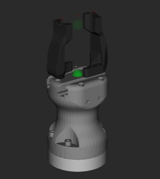

# dextivr_hande

Description and deploy packages for the dextivr Hand-E gripper.
This package wraps the Robotiq Hand-E gripper with custom fingers for use in iMETRO.
These fingers enable easier grabbing of handles, containers, and other commonly manipulable objects in iMETRO.

Options are listed in [the dextivr xacro](./dextivr_hande_description/urdf/dextivr_hande.xacro).

The Hand-E pictured with `finger_v6` fingers:



## Citation

This project falls under the purview of the iMETRO project.
If you use this in your own work, please cite the following paper:

```bibtex
@INPROCEEDINGS{imetro-facility-2025,
  author={Dunkelberger, Nathan and Sheetz, Emily and Rainen, Connor and Graf, Jodi and Hart, Nikki and Zemler, Emma and Azimi, Shaun},
  booktitle={2025 22nd International Conference on Ubiquitous Robots (UR)},
  title={Design of the iMETRO Facility: A Platform for Intravehicular Space Robotics Research},
  year={2025},
  volume={},
  number={},
  pages={390-397},
  keywords={NASA;Moon;Seals;Maintenance engineering;Maintenance;Robots;Standards;Open source software;Testing;Logistics},
  doi={10.1109/UR65550.2025.11077983}}
```
